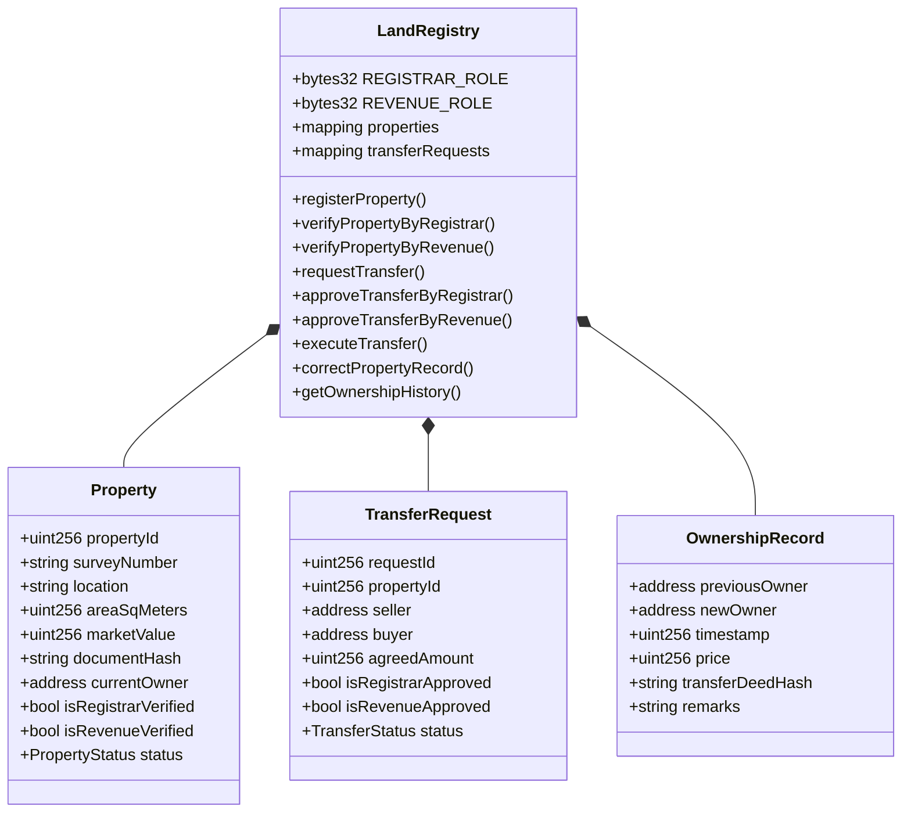
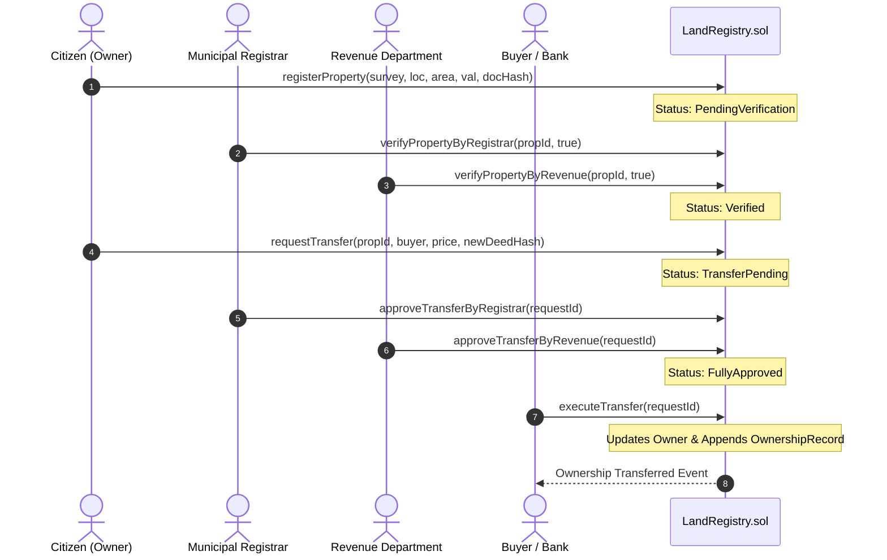

# Obsidian Code Breakdown: CadastreX Land Registry

## 1. System Components & Architecture

---

## 2. Transfer Execution Sequence Diagram

---

## 3. Security Checklist
- [x] **Zero Plaintext PII**: Sensitive records represented via IPFS content IDs / SHA-256 digests.
- [x] **Reentrancy Protection**: Critical state mutation functions use OpenZeppelin `ReentrancyGuard`.
- [x] **Granular Role Segregation**: Separation between Administrative, Municipal Registrar, and Revenue Authority capabilities.
- [x] **Strict Uniqueness Invariants**: Parcel survey numbers mapped to prevent double-registration collisions.
